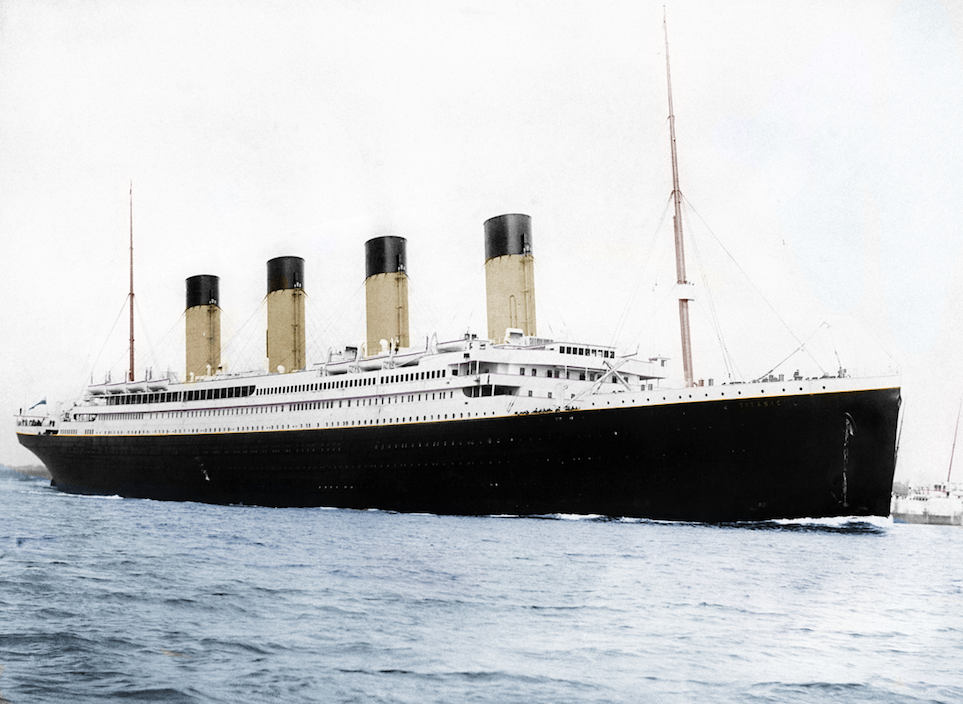

<script>
      (function(i,s,o,g,r,a,m){i['GoogleAnalyticsObject']=r;i[r]=i[r]||function(){
      (i[r].q=i[r].q||[]).push(arguments)},i[r].l=1*new Date();a=s.createElement(o),
      m=s.getElementsByTagName(o)[0];a.async=1;a.src=g;m.parentNode.insertBefore(a,m)
      })(window,document,'script','//www.google-analytics.com/analytics.js','ga');
      
      ga('create', 'UA-75601650-1', 'auto');
      ga('send', 'pageview');
      
</script>

```{r setup, include=FALSE}
knitr::opts_chunk$set(echo = TRUE, fig.align = "center")
```



As an introductory data science project, I have chosen to explore the data provided by the [Titanic: Machine Learning from Disaster](https://www.kaggle.com/c/titanic) competition hosted by Kaggle. The competition is to build the best model that can predict whether a given passenger survived the sinking of the Titanic. As a first step, I wanted to learn more about the passengers on board.

# The Data
Kaggle has split the passenger data into 2 subsets. Both data sets contain information about the gender, travel class, age, etc. for each passenger. The training data also indicates if the passenger survived or not, while the test data set does not. For this exploratory analysis, I am interested in learning about all of the passengers, and will be working with the combined data set.

We begin by loading the required packages:

```{r initialization, message = FALSE}
library(readr)
library(dplyr)
library(tidyr)
library(ggplot2)
library(ggmosaic)
library(stringr)

# set random number generator seed so analysis is repeatable
set.seed(9516549)
```

Next, we read the data files, and combine them into a single data frame. We also do some initial pre-processing to define categorical values for some of the variables.

```{r load, message = FALSE}
train_data <- read_csv(file.path('..','data','train.csv'))
test_data <-  read_csv(file.path('..','data','test.csv'))
```
```{r initial_view}
# Merge datasets, initial pre-processing
titanic_data <- train_data %>% 
  select(-Survived) %>% 
  bind_rows(test_data) %>% 
  mutate(Pclass = factor(Pclass), 
         Sex = factor(Sex),
         Embarked = factor(Embarked),
         Title = factor(str_extract(Name, "[a-zA-z]+\\.")),
         FamilyName = str_extract(Name, "[a-zA-z]*"))

# Convert variable names to lowercase
names(titanic_data) <- tolower(names(titanic_data))
```
Examining the structure, we find the variables:
```{r}
str(titanic_data)
```

```{r include=FALSE}
nfamilies <- titanic_data %>% 
  group_by(familyname) %>% 
  summarize(count = n()) %>% 
  summarize(N_Families = n())
```
While many of these are self-explanatory, we define the remainder below:

* **pclass:** The passengers ticket class, a proxy for socio-economic status:
    + 1: Upper
    + 2: Middle
    + 3: Lower
* **parch:** The number of parents/children traveling with the individual. Some children traveled with only a nanny, therefore parch = 0 for them.
* **sibsp:** The number of siblings/spouses traveling with the individual.
* **embarked:** The port of embarkation:
    + *C*: Cherbourg
    + *Q*: Queenstown
    + *S*: Southampton

Note there are `r nfamilies` unique family names.

## Dealing with Missing Data
In this case, the provided data set is quite complete, with data missing for only a few variables:
```{r echo = FALSE}
missing_vals <- sapply(titanic_data, function(df){sum(is.na(df))})
print(missing_vals)
```

In this section, we will address the missing values.

### Fare
There is only a single missing fare:
```{r}
missing_fare <- titanic_data %>% 
  filter(is.na(fare))
print(missing_fare)
```
Mr. Thomas Storey is a third class male passenger, who embarked at Southampton. We will estimate his fare with the average of all male third class passengers who embarked at Southampton:

```{r}
mean_fare <- titanic_data %>% 
  filter(pclass == missing_fare$pclass,
         embarked == missing_fare$embarked,
         sex == missing_fare$sex) %>% 
  summarize(mean_fare = mean(fare, na.rm = TRUE))
print(mean_fare)
titanic_data$fare[which(titanic_data$passengerid == missing_fare$passengerid)] <- mean_fare$mean_fare[1]
```

### Embarkation Port
There are two missing values for the port of embarkation:
```{r}
titanic_data %>% 
  filter(is.na(embarked))
```
As these two women are travelling alone (sibsp = 0, parch = 0), we don't have any other information that could tell us where they embarked. We will use the most common port of embarkation, Southampton.

```{r}
# set missing data to S, as the most common.
titanic_data$embarked[which(is.na(titanic_data$embarked))] <- "S"
```

### Age
There are a number of ways that missing ages could be estimated and in the simplest case, we could simply use the average age of all passengers. However, our passenger list provides a title for each passenger:

```{r echo = FALSE}
tb <- cbind(titanic_data$age, titanic_data$title)

# get the mean ages for each title
(age_dist <- titanic_data %>% 
  group_by(title) %>% 
  summarize(n = n(),
            n_missing = sum(is.na(age)),
            perc_missing = 100*n_missing/n,
            mean_age = mean(age, na.rm = TRUE),
            sd_age = sd(age, na.rm = TRUE),
            min_age = min(age, na.rm = TRUE),
            max_age = max(age, na.rm = TRUE)) %>% 
  filter(n_missing > 0))

```

Using this information, we can determine better estimates for the missing ages. We could simply use the average age of all passengers with a given title but in many cases the number of missing values is substantial. If we use the average age in these cases we will create a potentially unrealistic concentration in our age distribution. We will assume that the ages for each title are normally distributed with the mean and standard deviation provided in the table above. Following this replacement, we obtain the following distributions for the ages of our passengers:

```{r echo = FALSE}

titanic_data <- titanic_data %>% 
  mutate(age_est = 0)


bnorm <- function(nsamp, mean, std, lbound, ubound, rounding){
  samp <- round(rnorm(nsamp, mean, std), rounding)
  samp[samp < lbound] <- lbound
  samp[samp > ubound] <- ubound
  samp
}

for (key in c("Dr.", "Master.", "Miss.", "Mr.", "Mrs.")) {
  idx_na <- which(titanic_data$title == key & is.na(titanic_data$age))
  age_idx <- which(age_dist$title == key)
  titanic_data$age[idx_na] <- bnorm(length(idx_na), 
                                    age_dist$mean_age[age_idx], 
                                    age_dist$sd_age[age_idx],
                                    age_dist$min_age[age_idx],
                                    age_dist$max_age[age_idx],
                                    1)
  titanic_data$age_est[idx_na] <- 1
}
# impute single missing Ms. value to be the mean:
idx_na <- which(titanic_data$title == "Ms." & is.na(titanic_data$age))
age_idx <- which(age_dist$title == "Ms.")
titanic_data$age[idx_na] <- age_dist$mean_age[age_idx]
titanic_data$age_est[idx_na] <- 1

titanic_data %>% 
  group_by(title) %>% 
  summarize(n = n(),
            min_age = min(age),
            mean_age = mean(age),
            max_age = max(age))
```


# Who was onboard?

Now that we have completed the missing data, we can explore who was on the Titanic. We begin by exploring the passenger class, broken down by gender:

```{r plot_functions, echo = FALSE}
hist_by_gender <- function(data, var, title, xlab, bar_pos = "stack"){
  ylab = ifelse(bar_pos == "stack",
         "Number of Passengers", 
         "Proportion of Passengers")
  
  ggplot(data = data, aes_string(x = var, fill = "sex")) + 
    geom_bar(position = bar_pos) + 
    ggtitle(title) +
    labs(x = xlab,
         y = ylab) +
    scale_fill_discrete(name = "Gender",
                        breaks = c("female", "male"),
                        labels = c("Female", "Male"))
}
```
<div class="row">
<div class="col-md-6">
```{r echo = FALSE}
ggplot(titanic_data, aes(x = pclass, fill = sex)) + 
  geom_bar(position = "stack") + 
  ggtitle("Passenger Travel Class") +
  labs(x = "Travel Class",
       y = "Number of Passengers") +
  scale_fill_discrete(name = "Gender",
                      breaks = c("female", "male"),
                      labels = c("Female", "Male"))
```
</div>
<div class="col-md-6">
```{r echo = FALSE}
ggplot(titanic_data, aes(x = pclass, fill = sex)) + 
  geom_bar(position = "fill") + 
  ggtitle("Passenger Travel Class") +
  labs(x = "Travel Class",
       y = "Proportion of Passengers") +
  scale_fill_discrete(name = "Gender",
                      breaks = c("female", "male"),
                      labels = c("Female", "Male"))
```
</div>
</div>
Here we notice that the greatest number of passengers were in third class, and the least number of passengers in second class. We can also see that there are more males than females within each class.

As we already noticed, most of the passengers embarked at Southampton:
<div class="row">
<div class="col-md-6">
```{r echo = FALSE}
ggplot(titanic_data, aes(x = embarked, fill = sex)) + 
  geom_bar(position = "stack") + 
  ggtitle("Port of Embarkation") +
  scale_x_discrete(name = "Port",
                   breaks = c("C", "Q", "S"),
                   labels = c("Cherbourg", "Queenstown", "Southampton")) +
  labs(y = "Number of Passengers") +
  scale_fill_discrete(name = "Gender",
                      breaks = c("female", "male"),
                      labels = c("Female", "Male"))
```
</div>
<div class="col-md-6">
```{r echo = FALSE}
ggplot(titanic_data, aes(x = embarked, fill = sex)) + 
  geom_bar(position = "fill") + 
  ggtitle("Port of Embarkation") +
  scale_x_discrete(name = "Port",
                   breaks = c("C", "Q", "S"),
                   labels = c("Cherbourg", "Queenstown", "Southampton")) +
  labs(y = "Proportion of Passengers") +
  scale_fill_discrete(name = "Gender",
                      breaks = c("female", "male"),
                      labels = c("Female", "Male"))
```
</div>
</div>

## Why so many unmarried women?

We already saw that there were more males than females on the Titanic, which isn't unexpected. Each passenger also has a title (Mr., Mrs., etc.) and if we look at the distribution of titles among the passengers, we see something surprising:

```{r echo = FALSE}
titanic_data %>% 
  ggplot(aes(x = title, fill = sex)) +
  geom_bar() +
  ggtitle("Passenger Titles") +
  labs(x = "Title", 
       y = "Number of Passengers") +
  scale_fill_discrete(name = "Gender",
                      breaks = c("female", "male"),
                      labels = c("Female", "Male")) +
  theme(axis.text.x = element_text(angle = 90, hjust = 1, vjust = 0))
```

The largest group of women have the title Miss. We would expect these to be young, unmarried women traveling with their family. 

```{r echo = FALSE}
titanic_data %>% 
  filter(title == "Miss.") %>% 
  ggplot(aes(x = age, fill = factor(age_est, levels = c(1, 0)))) + 
  geom_histogram(binwidth = 5) +
  geom_rug() +
  ggtitle('Age distribution of passengers with title "Miss."') +
  scale_fill_discrete(name = "Age",
                      breaks = c("0", "1"),
                      labels = c("Reported", "Estimated")) +
  labs(x = "Age", 
       y = "Number of Passengers")

miss_data <- titanic_data %>% 
  filter(title == "Miss.") %>% 
  summarize(min = min(age),
            mean = mean(age),
            max = max(age))
```

They do indeed seem to be young women with an average age of `r round(miss_data$mean)`, Let's look at the immediate family connections of the passengers with title "Miss"

```{r echo = FALSE}
titanic_data %>% 
  filter(title == "Miss.") %>% 
  ggplot(aes(x = sibsp, fill = factor(parch))) + 
  geom_bar() + 
  ggtitle('Family connections of passengers with title "Miss."') +
  labs(x = "Number of Siblings onboard",
       y = "Number of passengers") + 
  scale_fill_discrete(name = "# Parents",
                      breaks = c(0, 1, 2))

solo_traveler <- titanic_data %>% 
  filter(title == "Miss.", 
         parch == 0,
         sibsp == 0) %>% 
  summarize(count = n()) %>% 
  select(count)
```
The majority of unmarried women (`r solo_traveler[1] `) are not traveling with any immediate family member. At that time (1912) it seems unlikely that unmarried women would travel unaccompanied, so **who were these women traveling with?**

## Travel Class

```{r include = FALSE}
titanic_data %>% 
  filter(title == "Miss.", 
         parch == 0,
         sibsp == 0) %>% 
  ggplot(aes(x = age, fill = factor(pclass))) + 
  geom_histogram(binwidth = 5) +
  ggtitle('Travel class of passengers with title "Miss." without family members') 
```

One thing of note, is that both women with the unknown embarkation port have the same ticket number. We will explore the ticket numbers here to determine what information is contained in them.

## Duplicate ticket numbers

```{r include = FALSE}
ntickets <- titanic_data %>% 
  group_by(ticket) %>% 
  summarize(count = n()) %>% 
  summarize(N_tickets = n())

print(ntickets$N_tickets[1])

```
There are only `r ntickets$N_tickets[1]` unique ticket numbers. This may be an indication of travelling group size. We explore a few permutations:
```{r}
titanic_data %>% 
  group_by(ticket, familyname) %>% 
  summarize(count = n()) %>% 
  arrange(desc(count)) %>% 
  head(10)

titanic_data %>% 
  group_by(ticket, familyname) %>% 
  summarize(count = n()) %>% 
  arrange(familyname) %>% 
  head(10)

titanic_data %>% 
  group_by(ticket, familyname) %>% 
  summarize(count = n()) %>% 
  #arrange(familyname) %>% 
  head(10)

```
Looking at the above results, we see some things to investigate futher:
1. Three unrelated people travelling on ticket 110152
```{r}
titanic_data %>% 
  filter(ticket == 110152)
```
Here we see three women traveling in first class, two of which are sharing a cabin. Exploring further, using the [Encyclopedia Titanica](https://www.encyclopedia-titanica.org/) an online directory of all passengers, We find that 
>The Countess [Rothes] boarded the Titanic at Southampton with her parents (travelling cross-channel only), her cousin Gladys Cherry and her maid Roberta Maioni.

2. Two people with the last name Abelseth travelling on different tickets
```{r}
titanic_data %>% 
  filter(familyname == "Abelseth")
```
Again, using the Encyclopedia Titanica we discover
>Miss Abelseth was travelling with Olaus Abelseth (who, being a family friend, accompanied her but was no relation), Anna Salkjelsvik, Peter Søholt, Sigurd Hansen Moen and Adolf Humblen.
So in this case, individuals travelling together do not have the same ticket number.
3. A large group with last name Sage all travelling on the same ticket
```{r}
titanic_data %>% 
  filter(familyname == "Sage")
```
In this case we see the Sage family (2 parents and 9 children) are indeed all traveling together on the same ticket.

From this exploration, we can conclude that individuals with the same ticket number are indeed travelling together, but there are also groups travelling together that do not share the same ticket number.

It is reasonable to assume that many of the seemingly unaccompanied women are travelling with other people, but perhaps not sharing the same ticket number.

### cut this section
Taking this information into account, we can eliminate the women traveling with the same ticket as another person:
```{r}
shared_ticket <-  titanic_data %>% 
    group_by(ticket) %>% 
    summarize(count = n()) %>% 
    filter(count > 1)

titanic_data <- titanic_data %>% 
  mutate(sharedticket = ifelse(ticket %in% shared_ticket$ticket, 1, 0))

```

```{r}
titanic_data %>% 
  filter(title == "Miss.", 
         parch == 0,
         sibsp == 0, 
         sharedticket == 0) %>% 
  ggplot(aes(x = age, fill = factor(pclass))) + 
  geom_histogram(binwidth = 5) +
  ggtitle('Travel class of passengers with title "Miss." without family members, or shared ticket') 
```


# Age distributions of other Titles
For completeness, we look at the age distributions of each of the titles with the most individuals: Mr., Mrs., Master., Miss.
```{r echo = FALSE}
titanic_data %>% 
  filter(title %in% c("Mr.", "Mrs.","Miss.", "Master.")) %>% 
  ggplot(aes(x = age, fill = factor(age_est, levels = c(1, 0)))) + 
  geom_histogram(binwidth = 5) +
  geom_rug() +
  facet_wrap(~ title) +
  ggtitle('Age distribution of passengers by title') +
  scale_fill_discrete(name = "Age",
                      breaks = c("0", "1"),
                      labels = c("Reported", "Estimated")) +
  labs(x = "Age", 
       y = "Number of Passengers")

```
These results appear as we would expect, young males are given the title "Master", and there are no very young women with the title "Mrs." The wide range for the "Miss" title can be attributed to the fact that any unmarried woman is given that title regardless of age.

## Cabin 
There are `r missing_vals['cabin']` missing cabin values (out of `r nrow(titanic_data)`) entries, but we may still be able to learn something from this.

```{r }
# count missing cabin values:
#titanic_data %>%
#  filter(is.na(cabin)) %>% 
#  summarize(n = n())
# 1014

# find shared tickets:
ticket_deck <-  titanic_data %>% 
  filter(!is.na(cabin)) %>% 
  distinct(ticket, .keep_all = TRUE) %>% 
  select(ticket, cabin) %>% 
  mutate(deck = substr(cabin, 0, 1)) %>% 
  select(-cabin)
  

# fill in missing deck from same ticket
titanic_data <- titanic_data %>% 
  merge(ticket_deck, by = "ticket", all.x = TRUE) %>% 
  mutate(tdeck = substr(cabin, 0, 1),
         deck = ifelse(!is.na(tdeck), tdeck, deck),
         deck = ifelse(is.na(deck), "U", deck)) %>% 
  select(-tdeck) 


```
```{r}
ggplot(titanic_data, aes(x = pclass, fill = deck)) + 
  geom_bar(position = "stack") + 
  ggtitle("Passengers Travel Class and Deck") +
  labs(x = "Travel Class",
       y = "Number of Passengers") +
  scale_fill_discrete(name = "Deck")
```

#Ticket prices at Southampton

We know that the airlines change ticket prices dramatically in response to consumer activity, and track our online browsing to inflate the price for trips we're interested in. Apparently this has been going on for a long time. Consider the ticket prices paid by the Titanic Passengers:


```{r echo = FALSE}
ggplot(titanic_data, aes(x = embarked, y = fare)) + 
  geom_boxplot(varwidth = TRUE) + 
  ggtitle("Passenger Fare by travel class, and embarkation port") +
  labs(x = "Port",
       y = "Fare") + 
  facet_grid(~ pclass)
```

Here the widths of each box are proportional to the number of passengers represented. We see something interesting: some passengers boarding at Southampton paid more for second and third class travel than the median first class ticket from the same port. If we just look at the Southampton data, and break it down by gender:

```{r echo = FALSE}
titanic_data %>% 
  filter(embarked == "S") %>% 
  ggplot(aes(x = sex, y = fare)) + 
    geom_boxplot(varwidth = TRUE) + 
    ggtitle("Passenger Fare by travel class, for Southampton departures") +
  scale_x_discrete(name = "Gender",
                   breaks = c("female", "male"),
                   labels = c("Female", "Male")) +
  labs(y = "Fare") +
  facet_grid(~ pclass)
```

Interestingly, female passengers tended to pay more for Southampton departures, and with greater variability. This doesn't seem to be the case at the other ports:

```{r echo = FALSE}
titanic_data %>% 
  filter(embarked == "C") %>% 
  ggplot(aes(x = sex, y = fare)) + 
    geom_boxplot(varwidth = TRUE) + 
    ggtitle("Passenger Fare by travel class, for Cherbourg departures") +
      scale_x_discrete(name = "Gender",
                   breaks = c("female", "male"),
                   labels = c("Female", "Male")) +
  labs(y = "Fare") + 
  facet_grid(~ pclass)

titanic_data %>% 
  filter(embarked == "Q") %>% 
  ggplot(aes(x = sex, y = fare)) + 
    geom_boxplot(varwidth = TRUE) + 
    ggtitle("Passenger Fare by travel class, for Queenstown departures") +
      scale_x_discrete(name = "Gender",
                   breaks = c("female", "male"),
                   labels = c("Female", "Male")) +
labs(y = "Fare") +  
  facet_grid(~ pclass)
```


So what happened in Southampton? Perhaps looking at the fare as determined by title will help explain this:

```{r echo = FALSE}
titanic_data %>% 
  filter(embarked == "S") %>% 
  filter(!(title %in% c("Capt.", "Col.", "Countess.","Jonkheer.", "Major.", "Ms.", "Rev.") )) %>% 
  ggplot(aes(x = pclass, y = fare)) + 
    geom_boxplot(varwidth = TRUE) + 
    ggtitle("Passenger Fare by travel class, for Southampton departures") +
  labs(x = "Travel Class",
       y = "Fare") + 
  facet_grid(~ title)

age_master <- titanic_data %>% 
  filter(title == "Master.") %>% 
  summarise(min = min(age), mean = mean(age), max = max(age))
```

Interestingly, the group with the highest average fare is "Master", or young boys less than  `r round(age_master$max[1])` years old. However, note that it is a relatively few passengers with this title, especially in first class, and the range is well within the price paid by both the Mr. and Mrs. passengers. Investigating futher we see
```{r}
titanic_data %>% 
  filter(title == "Master.",
         pclass == '1')
```
These are indeed a few (5) children travelling with very wealthy families who paid high ticket prices.

Similarily, we see:
```{r}

titanic_data %>% 
  filter(title == "Miss.",
         pclass == '1') %>% 
  ggplot(aes(x = fare, fill = factor(sharedticket, levels = c(1, 0)))) + 
  geom_histogram(binwidth = 5) +
  ggtitle('First Class Miss ticket prices') +
  scale_fill_discrete(name = "Accompanied",
                      breaks = c("0", "1"),
                      labels = c("No", "Yes")) +
  labs(x = "Ticket Price", 
       y = "Number of Passengers")
```
The variation in travel costs for young people who typically don't travel alone is therefore due to the range of wealth of their travelling companions, and the relatively small number of these individuals.

We still see some third class passengers who paid more than many first class passengers, and inconsistent pricing within each class depending on the passenger's title. **How were passenger fares determined?**

Let's look at all southampton departures, and compare ticket prices to deck of travel, for now we will only consider passengers with known deck

```{r}
titanic_data %>% 
  filter(deck != "U") %>% 
  ggplot(aes(x = fare, fill = pclass)) +
  geom_histogram(binwidth = 5) + 
  facet_wrap(~ deck)

titanic_data %>% 
  filter(deck == "U") %>% 
  ggplot(aes(x = fare, fill = pclass)) +
  geom_histogram(binwidth = 5) 

```


# Conclusions
Through this exploratory analysis, we encountered two surprising trends in the data that suggested further avenues of investigation. and explored these things in more detail.

1. **Ticket Prices for Southampton Departures:** While there were no obvious trends in the ticket price data, further analysis using machine learning techniques (cluster analysis, or regression models) may reveal underlying patterns.

2. **Who are the unmarried women traveling with?** There are online resources, such as the [Encyclopedia Titanica](https://www.encyclopedia-titanica.org/) that contain biographies of each passenger. A quick investigation of two unmarried women found that one was traveling with her aunt and uncle, and the other with close family friends. I suspect that this is the case for many of the young women traveling without immediate family. A future project involving text mining could investigate this further.


# What's next?
As mentioned previously, the Titanic data set was obtained from a Kaggle competition to build a model that will predict a passenger's survival. The next step will be to explore machine learning techniques and select an appropriate model for the passenger survival. Look for a followup project in the future.
